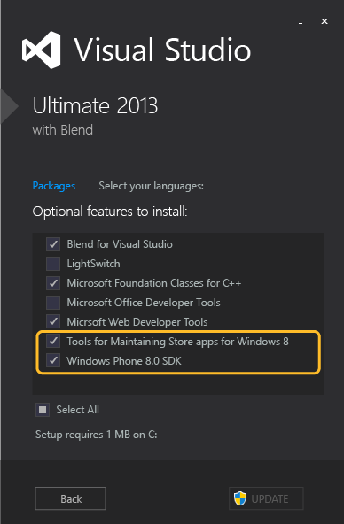
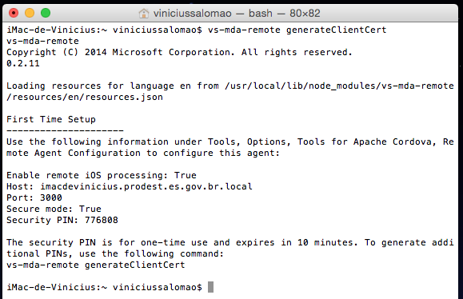
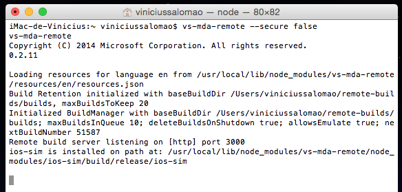

# Configuração Windows

## ​O que deve ser instalado

No Painel de Controle > Adicionar e remover programas clicar na instalação do Visual Studio e depois em Alterar. Adcionar os seguintes items a instalação do VS, caso ainda não tenham sido instalados. VS WP8 SDK
​Instalar Visual Studio Tools for Apache Cordova

Obs: O instalador vai adicionar uma extensão no Visual Studio e depois vai sugerir vários softwares de terceiros. Alguns são obrigatórios, outros apenas de acordo com a plataforma que será utilizada. Cada uma dessas ferramentas pode ser instalada manualmente, mais informações no 1º link das referências.

### Referências:

​https://msdn.microsoft.com/en-us/library/dn757054.aspx​

# Configuração Mac

## Componentes que devem ser instalados no mac

1. XCode
	* Instalado pela AppStore
2. Xcode command-line tools
	* Pelo Terminal app, use: xcode-select --install
3. NodeJs
	* Baixar pelo site e instalar. Devido as configurações de proxy da prodest e um problema no node 12, instalar a versão 10.
4. vs-mda-remote (Plugin do Visual Studio Tools for Apache Cordova)
	* sudo npm install -g vs-mda-remote --user=<usuario>​ 
	* https://msdn.microsoft.com/en-us/library/dn771551.aspx​ 
	
	
O Cordova será instalado automaticamente assim que a primeira aplicação tentar ser compilada no Mac, caso isso não ocorra execute o comando no terminal:

	sudo npm install -g cordova

Para compilar uma aplicação é necessário iniciar o plugin vs-mda-remote e realizar algumas configurações no Visual Studio (Windows)

Para iniciar o plugin basta executar

	vs-mda-remote ​

Isso inicia o agente e exibe algumas informações para configuração do Visual Studio (o terminal onde o comando foi inserido deve permanecer aberto sem executar nenhum outro comando, caso contrário o agente será finalizado). o PIN gerado tem validade de 10 min e só pode ser utilizado uma vez, caso seja necessário gerar outro, deve-se executar o comando

	vs-mda-remote generateClientCert
	

Caso seja necessário iniciar o agente sem o PIN de segurança

	vs-mda-remote --secure false
	

Exemplo de como o terminal permanece quando o agente está em execução

## O que deve ser configurado no Windows

No visual Studio em Tools > Options > Tools for Apache Cordova > Remote Agent Configuration insira as informações que estão no Mac, assim, caso seja necessário compilar e testar a aplicação no iPhone o VS vai conseguir se comunicar com o Mac copiar os arquivos do projeto e compilar. 

### ​Referências:

https://msdn.microsoft.com/en-us/library/dn771551.aspx

https://msdn.microsoft.com/en-us/library/dn757056.aspx

https://cordova.apache.org/docs/en/4.0.0/guide_cli_index.md.html​​